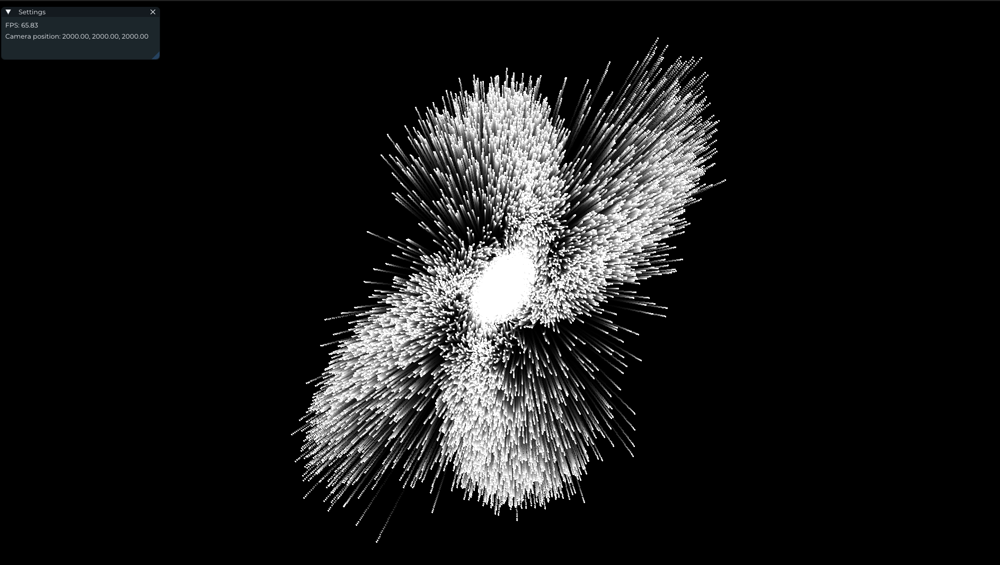

# slang-particles




```bash
# Run the Greedy version
uv run main.py type=greedy num_particles=100000

# Run the Tiled version
uv run main.py type=tiled num_particles=100000
```

## Controls
- left mouse drag: rotate camera
- W/A/S/D/E/Q: move camera

## Examples
### 1. Greedy example
Each particle's force is calculated by a single thread without any shared memory optimization.
This is simple but computationally expensive for large particle counts.

### 2. Fast N-Body Simulation
This mode implements a tiled approach based on [Chapter 31. Fast N-Body Simulation with CUDA | NVIDIA Developer](https://developer.nvidia.com/gpugems/gpugems3/part-v-physics-simulation/chapter-31-fast-n-body-simulation-cuda).
Particles are processed in tiles using shared memory, significantly improving memory access efficiency and overall performance.

## Comparison


- Tiled version is faster than Greedy when the number of particles is large.
- it is measured on my GPU (RTX 5080)